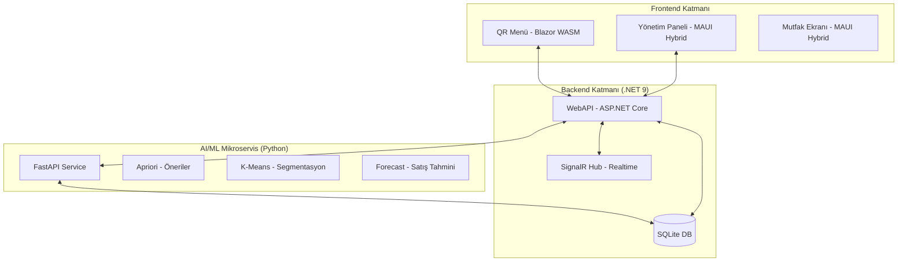
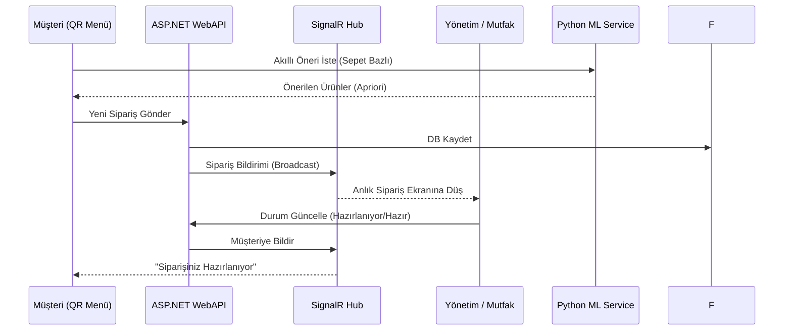

# XPos – AI Destekli Restoran POS Ekosistemi

Modern restoranlar için geliştirilmiş, uçtan uca tam yönetim çözümü. QR kod tabanlı müşteri menüsü, makine öğrenmesi destekli öneri motoru, gerçek zamanlı sipariş takibi ve kapsamlı yönetim paneliyle donatılmıştır.

---

## 🏗️ Mimari Genel Bakış

Proje **Clean Architecture** prensiplerine dayalı olarak katmanlı bir yapıda geliştirilmiştir. Backend, Frontend ve Yapay Zeka bileşenleri birbirleriyle REST API ve SignalR üzerinden haberleşir.

### 📊 Sistem Mimarisi


---

## ⚙️ Bileşenler ve Teknolojiler

### 1. 🌐 QR Menü (XPos.Client)
Müşterilerin masalarındaki QR kodu okutarak eriştikleri self-servis arayüzdür.
- **AI Lezzet Sihirbazı:** Sepete eklenen ürünlere göre gerçek zamanlı "Yanında iyi gider" önerileri sunar.
- **Dinamik Kampanyalar:** Hava durumu ve saate göre değişen aktif fırsatları gösterir.
- **Teknoloji:** Blazor WebAssembly, MudBlazor, SignalR.

### 2. 🖥️ Yönetim & Mutfak (XPos.Mobile)
Restoran sahibinin ve mutfak ekibinin kullandığı ana kontrol merkezidir.
- **Dashboard:** Günlük ciro, masa doluluk ve anlık sipariş takibi.
- **Müşteri Segmentasyonu:** K-Means algoritması ile müşterileri "Premium", "Hızlı Öğle", "Sosyal Grup" gibi davranışsal sınıflara ayırır.
- **Teknoloji:** .NET MAUI (Windows & Android), Blazor Hybrid.

### 3. 🧠 AI Mikroservis (XPos.ML)
Sistemin beyni olan Python tabanlı servistir.
- **Apriori Algorithm:** Milyonlarca satır veriyi analiz ederek ürünler arası gizli korelasyonları bulur.
- **Sales Forecast:** Geçmiş verilere ve hava durumuna bakarak gelecek 7-30 günün cirosunu tahmin eder.
- **Teknoloji:** FastAPI, Pandas, Scikit-learn, Mlxtend.

---

## 🔄 Sipariş Akış Diyagramı



---

## 🚀 Kurulum ve Başlatma

### Ön Gereksinimler
- **.NET 9 SDK**
- **Python 3.10+** (FastAPI ve gerekli kütüphaneler)
- **Windows 10/11** (MAUI Desktop için)

### Hızlı Başlat (Önerilen)
Proje kökünde bulunan `RunApps.ps1` betiği tüm bileşenleri (API, Client, ML) tek seferde ayağa kaldırır:
```powershell
.\RunApps.ps1
```

### Manuel Kurulum

**1. Python AI Servisi:**
```bash
cd src/XPos.ML
pip install -r requirements.txt
uvicorn app:app --port 5001 --reload
```

**2. Backend API:**
```bash
cd src/XPos.WebAPI
dotnet run
```

**3. Yönetim Paneli (MAUI):**
```bash
cd src/XPos.Mobile
dotnet run -f net9.0-windows10.0.19041.0
```

---

## 📡 Varsayılan Portlar

| Servis | Adres |
|---|---|
| **WebAPI** | `http://localhost:5029` |
| **QR Client** | `http://localhost:5030` |
| **ML Service** | `http://localhost:5001` |
| **Swagger** | `http://localhost:5029/swagger` |

---

## 💳 Ödeme Sistemi Entegrasyonu (Gelecek Vizyonu)
Mevcut yapı, fiziksel POS (RS232/IP) ve SoftPOS entegrasyonlarına uygun şekilde soyutlanmıştır. `PaymentService` üzerinden banka entegrasyonları kolayca genişletilebilir.

---

*Geliştirici Notu: AI modelleri her 3000 siparişte bir veya manuel tetikleme ile otomatik olarak yeniden eğitilmektedir.*
